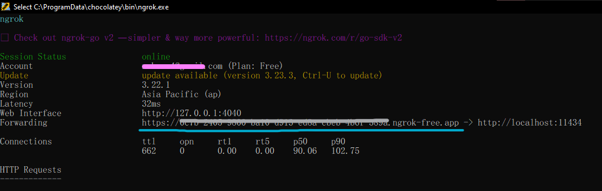

# Agnos Health LLM - Medical Forum RAG System

A comprehensive Retrieval-Augmented Generation (RAG) system for medical forums, built with Streamlit, Ollama, Pinecone, and BGE-M3 embeddings. This project processes Thai medical forum data and provides intelligent medical consultation through vector search and LLM responses.

## 🏥 Project Overview

This system consists of several key components:
- **Web Scraping**: Automated collection of medical forum data from Agnos Health
- **Data Processing**: Batch processing and embedding of forum content
- **Vector Database**: Pinecone integration for semantic search
- **LLM Interface**: Streamlit app with Ollama integration for medical consultations
- **RAG Pipeline**: Retrieval-augmented generation for evidence-based responses

## 🛠️ Technology Stack

### Core Technologies
- **Python 3.9+** - Main programming language
- **Streamlit** - Web application framework
- **Ollama** - Local LLM inference engine
- **Pinecone** - Vector database for semantic search
- **BGE-M3** - Multilingual embedding model (1024 dimensions)
- **PyTorch** - Deep learning framework
- **Firecrawl** - Web scraping API service

### Key Libraries
- `sentence-transformers` - BGE-M3 embeddings
- `pinecone-client` - Vector database client
- `langchain-pinecone` - LangChain integration
- `langchain-community` - LangChain community components
- `crawl4ai` - Open-source web scraping with anti-bot protection
- `firecrawl` - Firecrawl API client for web scraping
- `requests` - HTTP client for API calls
- `python-dotenv` - Environment variable management

## 📁 Project Structure

```
agnos-task-1/
├── app.py                          # Main Streamlit application
├── utils.py                        # Core utilities (TextEmbedder, PineconeManager)
├── scrapper.py                     # Web scraping for forum data
├── firecrawl_scrape.py             # Alternative scraping method
├── pinecone_batch_upsert.py        # Batch processing and vector upsert
├── ollama_client.py                # Ollama API client
├── requirements.txt                # Python dependencies
├── data_scraped_txt/               # Scraped forum data
├── upserted_data/                  # Processing results and summaries
├── .streamlit/                     # Streamlit configuration
├── img/                           # Images and screenshots
├── venv/                          # Virtual environment
└── README.md                      # This file
```

## 🚀 Quick Start

### 1. Environment Setup

```bash
# Clone the repository
git clone <repository-url>
cd agnos-task-1

# Create virtual environment
python -m venv venv
# On Windows:
.\venv\Scripts\activate
# On macOS/Linux:
# source venv/bin/activate

# Install dependencies
pip install -r requirements.txt
```

### 2. Environment Variables

Create a `.streamlit/secrets.toml` file or set environment variables:

```bash
# Pinecone Configuration
PINECONE_API_KEY="your_pinecone_api_key"
PINECONE_ENVIRONMENT_CLOUD="aws"
PINECONE_ENVIRONMENT_REGION="us-east-1"
PINECONE_INDEX_NAME="agnos-forums"

# Ollama Configuration (if using remote)
OLLAMA_SERVICE_URL="http://localhost:11434"
NGROK_BASIC_AUTH_USERNAME="username"
NGROK_BASIC_AUTH_PASSWORD="password"

# Development mode (remove this on production deployment)
is_dev="true"
```

### 3. Start Ollama Service with Ngrok Tunnel

#### 3.1 Install Ollama
```bash
# Install Ollama (if not already installed)
# Visit: https://ollama.ai/

# Pull desired models
ollama pull gemma3:latest
ollama pull gemma3:1b
ollama pull mistral
ollama pull deepseek-r1:latest

# Check available/downloaded models
ollama list
```

#### 3.2 Install Ngrok
```bash
# Download and install ngrok from https://ngrok.com/
# Or use package manager:
# Windows: choco install ngrok
# macOS: brew install ngrok
# Linux: snap install ngrok

# Authenticate ngrok (get authtoken from ngrok dashboard)
ngrok config add-authtoken YOUR_NGROK_AUTHTOKEN
```

#### 3.3 Configure Ngrok Authentication
Set up basic authentication credentials in your environment:

```bash
# Set ngrok authentication credentials 
# Can be set in ".streamlit/secrets.toml" or ".env" file
NGROK_BASIC_AUTH_USERNAME="your_username"
NGROK_BASIC_AUTH_PASSWORD="your_secure_password"
```

#### 3.4 Start Ollama with Ngrok Tunnel
```bash
# Start Ollama service with ngrok tunnel
.\start_service.bat
```

This script will:
1. **Start Ollama server** on port 11434 by default
2. **Create ngrok tunnel** with basic authentication
3. **Generate policy file** (`policy_basic_auth.yaml`) with your credentials
4. **Display ngrok URL** in the console



#### 3.5 Configure Application with Ngrok URL
After the console shows the ngrok URL:

1. **Copy the ngrok URL** (e.g., `https://aaa.bbb.ccc.dddd.ngrok-free.app`)
2. **Update your `.streamlit/secrets.toml` or `.env`** file:
   ```toml
   OLLAMA_SERVICE_URL = "https://aaa.bbb.ccc.dddd.ngrok-free.app"
   NGROK_BASIC_AUTH_USERNAME = "your_username"
   NGROK_BASIC_AUTH_PASSWORD = "your_secure_password"
   ```

**Important Notes:**
- The ngrok URL changes each time you restart the tunnel
- Keep your authentication credentials secure
- The tunnel provides secure access to your local Ollama instance
- Basic authentication prevents unauthorized access to your LLM service

### 4. Run the Application

```bash
# Start the Streamlit app
streamlit run app.py
```

The application will be available at `http://localhost:8501`

## 📊 Data Processing Pipeline

### Step 1: Web Scraping

The system can scrape medical forum data using two methods:

#### Method A: Using scrapper.py (Recommended)
```bash
python scrapper.py
```

**Features:**
- Anti-bot protection with Crawl4AI
- Automatic URL discovery
- Rate limiting and session management
- Outputs to `data_scraped_txt/` directory

#### Method B: Using firecrawl_scrape.py
```bash
python firecrawl_scrape.py
```

**Features:**
- Firecrawl API integration
- Structured data extraction
- Metadata preservation

### Step 2: Data Processing and Vector Upsert

```bash
python pinecone_batch_upsert.py
```

**Features:**
- Batch processing (20 documents per batch)
- Smart deduplication
- Metadata extraction (URL, timestamp, reply count)
- Content chunking (1000 chars with 150 char overlap)
- BGE-M3 embeddings (1024 dimensions)
- Pinecone vector storage

**Output:**
- Vector embeddings in Pinecone index
- Processing summary in `upserted_data/batch_processing_summary.json`
- Console progress tracking

### Step 3: RAG Application

The Streamlit app provides:
- **Model Selection**: Choose from available Ollama models
- **RAG Settings**: Enable/disable vector search, adjust context documents
- **Temperature Control**: Adjust response creativity
- **System Prompt**: Customize AI behavior
- **Chat Interface**: Interactive medical consultation

## 🔧 Configuration Details

### TextEmbedder Configuration
```python
# BGE-M3 model with CPU/GPU optimization
embedder = TextEmbedder(model_name="BAAI/bge-m3")
```

**Features:**
- Automatic device detection (CUDA/CPU)
- Meta tensor error handling
- Fallback embeddings for error cases
- Normalized embeddings for cosine similarity

### PineconeManager Configuration
```python
pinecone_manager = PineconeManager(
    api_key="your_api_key",
    index_name="agnos-forums",
    dimension=1024,
    cloud="aws",
    region="us-east-1",
    embedder=embedder
)
```

**Features:**
- Automatic index creation
- Document chunking and embedding
- Semantic search with metadata filtering
- MMR (Maximal Marginal Relevance) search

### OllamaClient Configuration
```python
ollama_client = OllamaClient(
    base_url="http://localhost:11434",
    username="username",  # Optional
    password="password"   # Optional
)
```

**Features:**
- Local and remote Ollama support
- Basic authentication for ngrok tunnels
- Model discovery and management
- Streaming response support

## 📈 Metadata Structure

Each forum post is processed with the following metadata:

```json
{
  "source": "https://www.agnoshealth.com/forums/example/123",
  "info": "Additional forum information",
  "forum_posted_timestamp": "8/22/2022",
  "forum_reply_count": 3.0,
  "scraped_at": "2025-07-06T00:50:27.127031",
  "record_index": 3.0,
  "content": "Original forum post content"
}
```

## 🎯 Usage Examples

### Medical Consultation
1. **Start the app**: `streamlit run app.py`
2. **Enable RAG**: Check "Enable RAG (Vector Search)" in sidebar
3. **Ask medical questions**: 
   - "อาการปวดหัวและเวียนหัวหมายถึงอะไร?"
   - "วิธีรักษาอาการนอนไม่หลับ"
   - "สัญญาณของโรคซึมเศร้า"

### Data Processing
```bash
# Process all forum data
python pinecone_batch_upsert.py

# Check processing results
cat upserted_data/batch_processing_summary.json
```

### Testing Embeddings
```bash
# Test embedding functionality
python test_embedder_fix.py
```

## 🔍 Troubleshooting

### Common Issues

#### 1. PyTorch Meta Tensor Error
**Error**: "Cannot copy out of meta tensor"
**Solution**: The TextEmbedder class includes automatic CPU fallback and minimal settings to avoid this issue.

#### 2. Pinecone Connection Issues
**Error**: "Failed to initialize RAG service"
**Solution**: 
- Verify Pinecone API key and environment settings
- Check internet connection
- Ensure index exists or can be created

#### 3. Ollama Connection Issues
**Error**: "No models found"
**Solution**:
- Ensure Ollama service is running: `ollama serve`
- Check if models are pulled: `ollama list`
- Verify service URL in configuration

#### 4. CUDA/GPU Issues
**Error**: CUDA-related errors
**Solution**: The system automatically falls back to CPU if CUDA is unavailable.

### Debug Mode

Enable debug mode to see detailed logs:
```bash
# On Windows:
set is_dev="true"

# On macOS/Linux:
export is_dev="true"
```

## 📊 Performance Optimization

### Batch Processing
- **Batch Size**: 20 documents per batch (configurable)
- **Chunk Size**: 1000 characters with 150 character overlap
- **Embedding Dimension**: 1024 (BGE-M3 standard)

### Memory Management
- Automatic garbage collection
- Streaming responses to reduce memory usage
- Efficient text chunking

### Search Optimization
- Cosine similarity for semantic search
- MMR for diverse results
- Metadata filtering for targeted queries

## 🔒 Security Considerations

- **API Keys**: Store securely in environment variables or Streamlit secrets
- **Rate Limiting**: Built-in delays to respect website policies
- **Authentication**: Optional basic auth for remote Ollama instances
- **Data Privacy**: Local processing with optional cloud vector storage

## 📝 Development

### Adding New Models
1. Pull model in Ollama: `ollama pull model_name`
2. Model will appear automatically in the app's model selector

### Customizing System Prompt
Edit the `get_system_prompt()` function in `utils.py` to modify AI behavior.

### Extending Data Sources
Add new scraping scripts following the pattern in `scrapper.py` or `firecrawl_scrape.py`.

## 🤝 Contributing

1. Fork the repository
2. Create a feature branch
3. Make your changes
4. Test thoroughly
5. Submit a pull request

## 📄 License

This project is licensed under the MIT License - see the LICENSE file for details.

## 🙏 Acknowledgments

- **Agnos Health** for providing the forum data
- **BAAI** for the BGE-M3 embedding model
- **Ollama** for local LLM inference
- **Pinecone** for vector database services
- **Streamlit** for the web application framework

---

**Note**: This system is designed for educational and research purposes. Medical advice should always be verified with qualified healthcare professionals.
